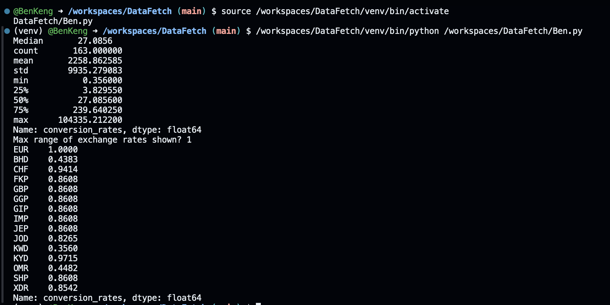

# DataFetch
Overview
This program fetches the latest currency exchange rates for the Euro from an online API, processes the data, and lets the user filter and save the results.
How it works
-Connects to an API to get the most recent exchange rates.
-Loads the data into a table format for easy analysis.
-Calculates useful statistics, such as the median and other summary values.
-Asks the user for a maximum exchange rate limit.
-Filters the list so only currencies with rates less than or equal to that limit are shown.
-Saves the filtered list into a CSV file for later use.

Example output first shows general information about the exchange rate data. Then when user is asked for a number the user inputs 1, which results in the return of all the exchange rates that are below 1 in comparison to the euro.
